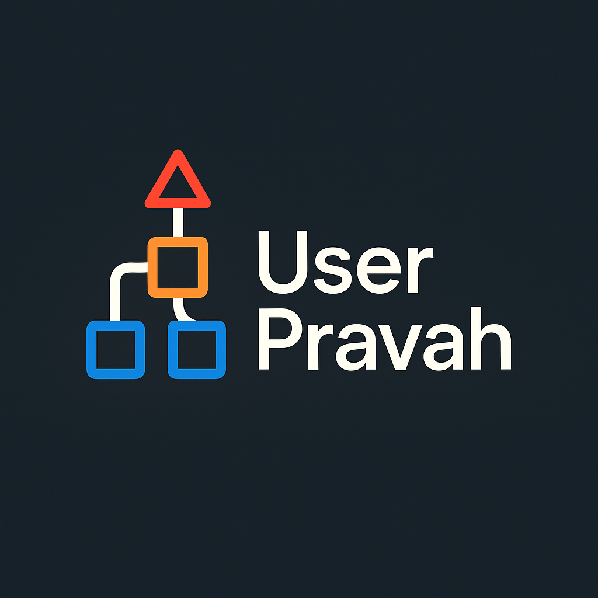
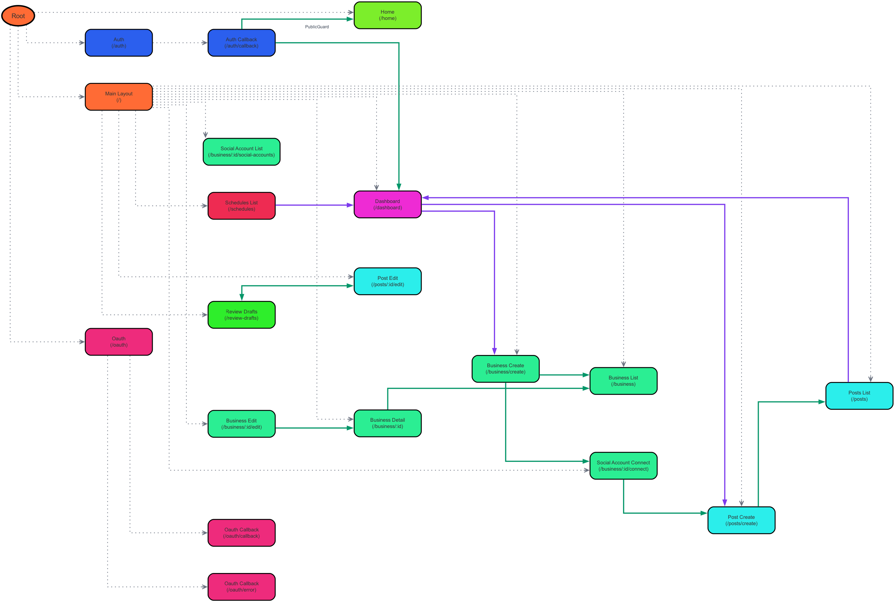

# User Pravah - User Flow Visualizer

## Community & Discussion

Join our Discord server for healthy discussions, to ask questions, share ideas, or to collaborate on UserPravah!

[](https://discord.gg/HXqWcdjv)

## Overview


UserPravah (where "Pravah" means *flow*) is a versatile command-line tool for analyzing web applications and generating visual diagrams of user navigation paths and page-to-page flows. It helps developers,tester and all stake holders understand complex application user flows, page to page navigations and document user journeys.


Here's an example of what UserPravah can generate for an Angular application:



This tool is invaluable for:
*   Understanding complex application architectures.
*   Onboarding new developers.
*   Identifying dead-ends or overly complex navigation paths.
*   Documenting application flow.
*   Refactoring and planning new features.

Currently, UserPravah offers comprehensive support for **Angular** projects, with plans to expand to other frameworks (see Roadmap).

## Features

*   **Framework-Specific Analysis**: Deeply understands the routing and navigation mechanisms of supported frameworks.
    *   **Angular (Current)**: Detects routes via `RouterModule`, `provideRouter`, standalone components (`loadComponent`), lazy-loaded modules, programmatic navigation (`router.navigate`, `router.navigateByUrl`), and template links (`[routerLink]`).
*   **Clear Visual Output**: Generates a `.dot` graph file and a `.png` image using Graphviz, showing pages/routes as nodes and navigations/relationships as edges.
*   **Customizable Node Appearance**: Nodes are colored and styled for better visual distinction.
*   **Handles Modern Architectures**: Adapts to both traditional (e.g., NgModules) and modern (e.g., standalone components) patterns within supported frameworks.

## Prerequisites

Before you can use this tool, you need to have the following installed:

*   **Node.js**: Version 16.x or higher is recommended.
*   **npm** (or yarn/pnpm): Usually comes with Node.js.
*   **Graphviz**: This is required to generate the PNG image from the DOT file. You can download it from [graphviz.org](https://graphviz.org/download/). Ensure the `dot` command is in your system's PATH.

## Installation

To install UserPravah globally, run the following command:
```bash
npm install -g userpravah
```


### How to run the CLI
Once installed, you can run UserPravah from your terminal:
```bash
userpravah <path_to_your_project_root>
```

### Example usage
For instance, if your project is in a directory named `my-angular-app`:
```bash
userpravah my-angular-app
```
Or, using an absolute path:
```bash
userpravah /Users/me/projects/my-cool-app
```

### Output explanation
Upon completion, UserPravah will generate the following files in your current directory (or a specified output directory in future versions):
*   `user-flows.dot`: The graph definition file in DOT language.
*   `user-flows.png`: The visual graph image.

## Usage

To analyze a supported project (currently Angular) and generate the user flow diagram:

1.  Navigate to the `graphgeneratorts` directory in your terminal.
2.  Run the `analyze` script using npm, providing the path to your project as an argument after `--`:

    ```bash
    # For Angular projects:
    npm run analyze -- <path_to_your_angular_project_root>
    ```

    **Examples (Angular):**

    *   If your Angular project is in a sibling directory called `my-angular-app`:
        ```bash
        npm run analyze -- ../my-angular-app
        ```
    *   If your Angular project is at `/Users/me/projects/my-cool-app`:
        ```bash
        npm run analyze -- /Users/me/projects/my-cool-app
        ```

    **Capturing Logs:**

    For debugging or detailed inspection, you can redirect the output to a file:
    ```bash
    npm run analyze -- <path_to_your_project> >> output.log
    ```

3.  The script will output logs to the console (or your specified file) during analysis.
4.  Upon completion, two files will be generated in the `graphgeneratorts` directory:
    *   `user-flows.dot`: The graph definition file in DOT language.
    *   `user-flows.png`: The visual graph image.

## Interpreting the Graph

*   **Nodes**: Represent pages or routes in your application.
    *   The label shows a display name (derived from the component or path segment) and the full route path.
    *   Nodes are colored based on their top-level path segment for easier visual grouping (e.g., `/auth` routes might share a color).
*   **Edges (Arrows)**: Represent navigation paths or relationships.
    *   **Solid Dark Green Arrows**: Programmatic navigation (e.g., `router.navigate()` in Angular).
    *   **Solid Steel Blue Arrows**: Template-based navigation (e.g., `[routerLink]` in Angular).
    *   **Dashed Blue Arrows**: Route redirects.
    *   **Gray Arrows (No Arrowhead)**: Hierarchical parent-child route relationships (structural, not direct navigations).

## How it Works (General Approach)

UserPravah employs a multi-stage process:

1.  **Project Loading**: Initializes an appropriate code analysis environment for the target project (e.g., using `ts-morph` for TypeScript-based projects like Angular).
2.  **Route/Page Discovery**: Parses framework-specific conventions to identify all possible pages, routes, and their configurations (e.g., routing modules, configuration files, decorators in Angular).
3.  **Navigation Extraction**: Scans source code (TypeScript, HTML templates, etc.) for navigation triggers, such as API calls that change routes or declarative links.
4.  **Graph Modeling**: Constructs an internal graph representation where pages/routes are nodes and navigations are edges.
5.  **Visualization**: Uses `ts-graphviz` and Graphviz to render the internal graph model into DOT and image (PNG) formats.

## Roadmap & Contributing

UserPravah is an evolving project, and contributions are highly welcome!

**Planned Features & Framework Support (Roadmap):**

*   **Current Focus**: Refining Angular support, improving error handling, and enhancing graph clarity.
*   **Next Frameworks (Potential Order):**
    *   React (with React Router)
    *   Vue.js (with Vue Router)
    *   Svelte / SvelteKit
    *   Other popular backend or full-stack frameworks if applicable for clear navigation patterns.
*   **Core Enhancements:**
    *   More sophisticated display name generation and node grouping.
    *   Support for identifying entry points and exit points.
    *   Interactive graph outputs (e.g., web-based UI, clickable nodes).
    *   Plugin architecture for easier addition of new framework analyzers.
    *   Configuration options (via file or CLI flags) for output, parsing depth, etc.

**How to Contribute:**

If you'd like to contribute to the development of UserPravah, here's how you can set up the project locally:

1.  **Clone the repository (or copy the `graphgeneratorts` directory):**
    ```bash
    # If you have the full project
    git clone https://github.com/[your_username]/userpravah.git # Replace with actual URL once created
    cd userpravah/graphgeneratorts 
    # Or if you just have the directory, navigate into it
    # cd graphgeneratorts 
    ```
    *(Note: The script currently resides in a subdirectory named `graphgeneratorts`. This might be streamlined in the future.)*

2.  **Install dependencies:**
    ```bash
    npm install
    ```
    This will install necessary packages like `ts-morph`, `node-html-parser`, `ts-graphviz`, etc.

3.  Open an issue to discuss the change, new feature, or report a bug.
4.  Fork the repository and submit a pull request with your changes.

## Testing

UserPravah uses a test suite based on mock Angular projects to ensure the accuracy and stability of its analysis and graph generation capabilities. This approach helps verify that the tool correctly interprets various Angular routing configurations and navigation patterns. For a detailed breakdown of specific features covered and planned for future tests, please see the [`TestCoverage.md`](./tests/TestCoverage.md) file.

**Testing Procedure:**

1.  **Mock Projects:** A collection of small, self-contained mock Angular projects are located in the `graphgeneratorts/tests/mock-projects/` directory. Each mock project is designed to test a specific feature or scenario, such as:
    *   Basic routing (`simple-app`)
    *   Lazy-loaded modules (`lazy-load-app`)
    *   (Future tests could include redirects, path parameters, programmatic navigation, etc.)

2.  **Expected Outputs:** For each mock project, there is a corresponding "expected" `.dot` graph file stored in `graphgeneratorts/tests/expected-outputs/`. This file represents the correct visual output UserPravah should generate for that specific mock project.

3.  **Test Execution:**
    *   A shell script, `graphgeneratorts/run-tests.sh`, automates the testing process.
    *   To run the tests, navigate to the `graphgeneratorts` directory and execute:
        ```bash
        chmod +x run-tests.sh
        ./run-tests.sh
        ```
    *   The script iterates through each mock project defined within it. For each project, it:
        1.  Runs the `npm run analyze -- <path_to_mock_project>` command.
        2.  Compares the generated `user-flows.dot` file with the corresponding expected `.dot` file from the `expected-outputs` directory using `diff`.

4.  **Test Results:**
    *   If the generated `.dot` file exactly matches the expected file, the test case is marked as a "SUCCESS".
    *   If there are differences, the test case is marked as a "FAILURE", and the `diff` output is displayed. The script will also provide a command to help update the expected file if the changes in the generated output are intentional and correct (e.g., after improving the graph generator).

**Why This Testing Approach?**

*   **Integration Testing:** This method effectively tests the integration of UserPravah's various components, from project loading and AST parsing (`ts-morph`) to route discovery, navigation extraction, and final DOT graph generation. It ensures the entire pipeline works as intended.
*   **Realistic Scenarios:** Analyzing small but realistic Angular project structures provides more meaningful validation of the core logic than isolated unit tests could for the complex analysis engine.
*   **Verifiable & Tangible Output:** The tests directly verify the `.dot` output, which is the primary artifact used to generate the visual diagrams. This makes it easy to confirm the correctness of the end result.
*   **Regression Prevention:** Once an expected output is established, these tests act as regression tests. They help catch any unintended changes or breakages in the graph generation logic as the codebase evolves.
*   **Extensibility:** New test cases for different Angular features or edge cases can be easily added by creating a new mock project and its corresponding expected `.dot` file.
*   **Development Aid:** When developing new features or refactoring the analyzer, failing tests provide immediate feedback, and the `diff` output helps pinpoint discrepancies. The ability to easily update the expected output (e.g., `cp ./user-flows.dot tests/expected-outputs/my-new-app.dot`) is useful during development iterations.

While this integration-focused testing is primary for the core analysis, traditional unit tests can and should be used for any utility functions or isolated logic within the codebase that do not heavily depend on the `ts-morph` project context or file system interactions.

## Disclaimer

**Please Note:** UserPravah is currently developed and maintained by an individual developer. While every effort is made to ensure its quality and accuracy, it is provided "as-is" and is **not recommended for critical production usage** at this stage.

Bugs are inevitable in any software project, especially one in active development. If you encounter any issues or unexpected behavior, please **report them via the GitHub Issues page** for this project. Your feedback and bug reports are invaluable!

With the help of the community through contributions and bug reporting, we can make UserPravah a more robust and reliable tool for everyone.

## License

This project is licensed under the MIT License. See the `LICENSE` file for details.